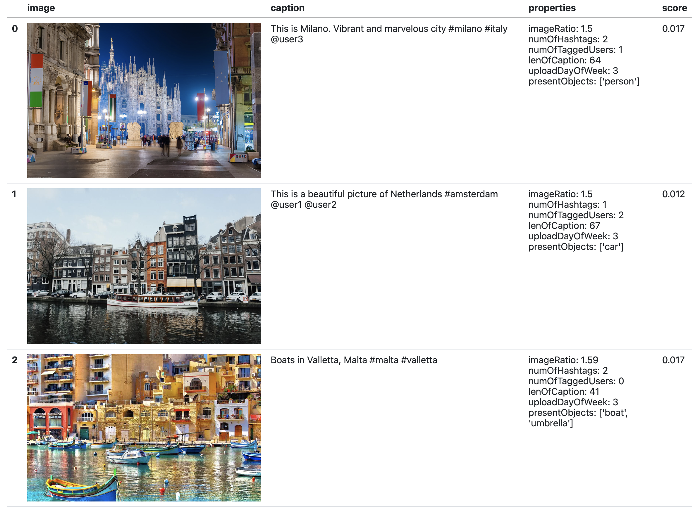

<!--
*** Thanks for checking out this README Template. If you have a suggestion that would
*** make this better, please fork the repo and create a pull request or simply open
*** an issue with the tag "enhancement".
*** Thanks again! Now go create something AMAZING! :D
-->


<!-- PROJECT SHIELDS -->
<!--
*** I'm using markdown "reference style" links for readability.
*** Reference links are enclosed in brackets [ ] instead of parentheses ( ).
*** See the bottom of this document for the declaration of the reference variables
*** for contributors-url, forks-url, etc. This is an optional, concise syntax you may use.
*** https://www.markdownguide.org/basic-syntax/#reference-style-links
-->
[![Contributors][contributors-shield]][contributors-url]
[![Forks][forks-shield]][forks-url]
[![Stargazers][stars-shield]][stars-url]
[![Issues][issues-shield]][issues-url]
[![MIT License][license-shield]][license-url]
[![LinkedIn][linkedin-shield]][linkedin-url]


<!-- PROJECT LOGO -->
<br />
<p align="center">
  <a href="https://github.com/inotin/instaSeer">
    
  </a>

  <p align="center">
    Choose the next best post
    <br />
    <br />
    <a href="https://github.com/inotin/instaSeer">View Demo</a>
    ·
    <a href="https://github.com/inotin/instaSeer/issues">Report Bug</a>
    ·
    <a href="https://github.com/inotin/instaSeer/issues">Request Feature</a>
  </p>
</p>


<!-- TABLE OF CONTENTS -->
## Table of Contents

* [About the Project](#about-the-project)
  * [Built With](#built-with)
* [Getting Started](#getting-started)
  * [Prerequisites](#prerequisites)
  * [Installation](#installation)
* [Usage](#usage)
* [Roadmap](#roadmap)
* [Contributing](#contributing)
* [License](#license)
* [Contact](#contact)
* [Acknowledgements](#acknowledgements)


<!-- ABOUT THE PROJECT -->
## About The Project

<!-- [![Product Name Screen Shot][product-screenshot]](https://example.com). -->


I was always interested in behavioral psychology. It is curious what makes people make certain decisions, why they behave one way or another, sometimes against the logic. Of course, it is hard to answer these questions in all situations. Still, one of them, which seems comparatively simple, is determining why people like what they see. But is it possible to build a model that could predict if an image (and a post in general) will be pleasant for most people?

### Data
Instagram has an enormous image database “labeled” by the number of likes; hence, I decided to use it. Instagram API does not allow scraping images and other post metadata. However, there is a library called Instascrape based on Beautiful Soup which has the required functionality.


### To Do List
- [x] Initial commit
- [x] Dockerize (create docker image)
- [ ] Scrape 5000 posts for model performance increase
- [ ] Apply clusterization to generate new features


### Built With

* [ImageAI](https://github.com/OlafenwaMoses/ImageAI)
* [Yolo V5](https://github.com/ultralytics/yolov5)
* [Instascrape](https://pypi.org/project/insta-scrape/)


<!-- GETTING STARTED -->
## Getting Started

### Prerequisites

All necessary packages are listed in requirements.txt and can be installed as follows
```sh
pip install -r requirements.txt
```
In case you face issues with keras package, uninstall keras and keras-nightly and reinstall keras again.

### Installation and usage

#### Using Git

1. Clone the repo
```sh
git clone https://github.com/inotin/instaSeer.git
```
3. Install necessary packages
```sh
pip install -r requirements.txt
```
4. Run the script providing:
 * urls for images separated by ';'
 * strings of corresponding captions separated by ';'

 All of the parameters should be separated by spaces.

```sh
url1='https://url.com/url1.png'
url2='https://url.com/url1.png'
url3='https://url.com/url1.png'
caption1='caption1'
caption2='caption2'
caption3='caption3'
python3 instaseer.py $url1';'$url2';'$url3 "$caption1';'$caption2';'$caption3"
```
#### Using Docker Image

1. Pull the Docker Image from [Docker Hub](https://hub.docker.com/r/inotin/instaseer)
2. Run the container providing directory for output files (use absolute path), image URLs and corresponding captions as follows
```sh
url1='https://url.com/url1.png'
url2='https://url.com/url1.png'
url3='https://url.com/url1.png'
caption1='caption1'
caption2='caption2'
caption3='caption3'
docker run -it -v /host/path/for/outputs:/instaseer/results instaseer $url1';'$url2';'$url3 "$caption1';'$caption2';'$caption3"
```


The script generates a table with data and scores for each post and saves it into results/ folder for further use e.g., embed into iframe as it's done on [my website](https://notin.it/instaSeer)

The generated files in results/ folder are:
* results.html - a table with data and scores for each post



<!-- ROADMAP -->
## Roadmap

See the [open issues](https://github.com/inotin/instaSeer/issues) for a list of proposed features (and known issues).


<!-- CONTRIBUTING -->
## Contributing

Contributions are what make the open source community such an amazing place to be learn, inspire, and create. Any contributions you make are **greatly appreciated**.

1. Fork the Project
2. Create your Feature Branch (`git checkout -b feature/AmazingFeature`)
3. Commit your Changes (`git commit -m 'Add some AmazingFeature'`)
4. Push to the Branch (`git push origin feature/AmazingFeature`)
5. Open a Pull Request


<!-- LICENSE -->
## License

Distributed under the MIT License. See `LICENSE` for more information.


<!-- CONTACT -->
## Contact

Ilia Notin - ilia@notin.it

Project Link: [https://github.com/inotin/instaSeer](https://github.com/inotin/instaSeer)


<!-- ACKNOWLEDGEMENTS -->
## Acknowledgements
* [Template for README.md](https://github.com/othneildrew/Best-README-Template/graphs/contributors)


<!-- MARKDOWN LINKS & IMAGES -->
<!-- https://www.markdownguide.org/basic-syntax/#reference-style-links -->
[contributors-shield]: https://img.shields.io/github/contributors/inotin/instaSeer.svg?style=flat-square
[contributors-url]: https://github.com/inotin/instaSeer/graphs/contributors
[forks-shield]: https://img.shields.io/github/forks/inotin/instaSeer.svg?style=flat-square
[forks-url]: https://github.com/inotin/instaSeer/network/members
[stars-shield]: https://img.shields.io/github/stars/inotin/instaSeer.svg?style=flat-square
[stars-url]: https://github.com/inotin/instaSeer/stargazers
[issues-shield]: https://img.shields.io/github/issues/inotin/instaSeer.svg?style=flat-square
[issues-url]: https://github.com/inotin/instaSeer/issues
[license-shield]: https://img.shields.io/github/license/inotin/instaSeer.svg?style=flat-square
[license-url]: https://github.com/inotin/instaSeer/blob/master/LICENSE.txt
[linkedin-shield]: https://img.shields.io/badge/-LinkedIn-black.svg?style=flat-square&logo=linkedin&colorB=555
[linkedin-url]: https://www.linkedin.com/in/inotin/
[product-screenshot]: images/screenshot.png
